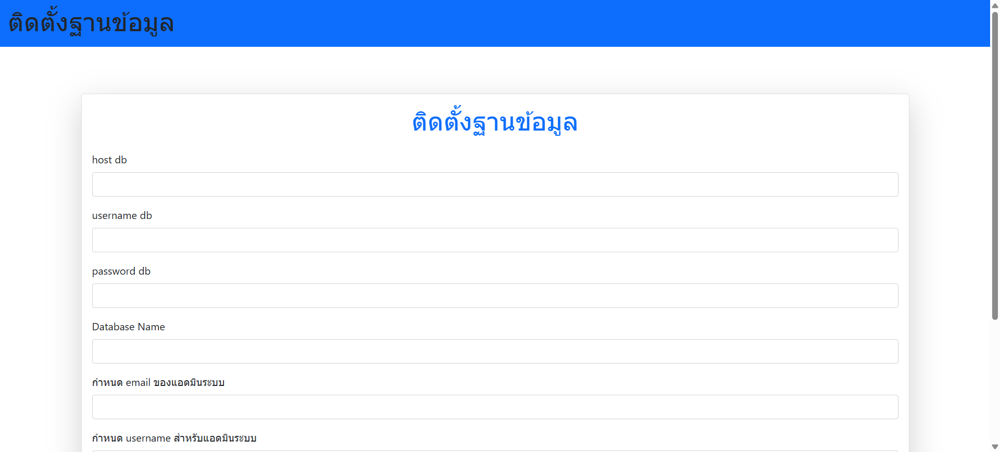
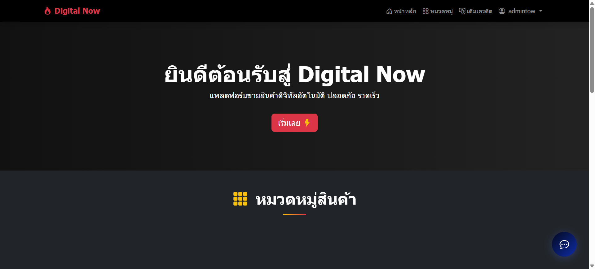

::production mode

cd "C:\Users\tow\Desktop\New Project\Laravel12\public"

php artisan optimize:clear

composer install --optimize-autoloader --no-dev

//php artisan config:cache host only

php artisan route:cache

php artisan view:cache

:: devmode
::composer install
::php artisan optimize:clear

upload all file to public_html

goto url homepage install 

success

